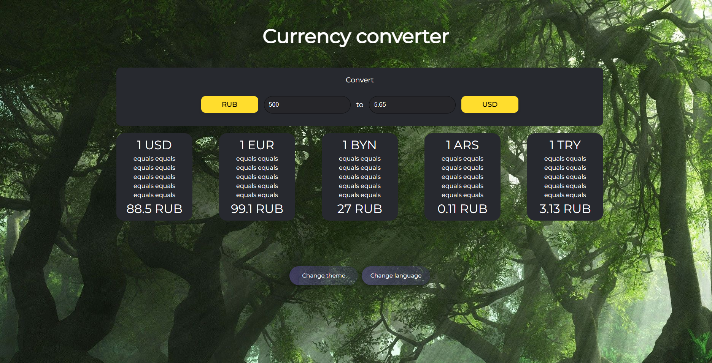

### What is it?

A simple and beautiful currency converter. Specially for you.

It has support for dark and white theme, and also supports Russian and English.


### How do I start using the project?

## Use it simple way
Just go to this website:

https://currency-converter-w2ys.onrender.com/ 

## Or do it the hard way

1. Install [node.js](https://nodejs.org/). Use the instructions on the website.
2. Copy the repository to your computer using git clone:
```
git clone https://github.com/HelgiMagic/currency-converter.git
```
3. To start using this project, copy and paste the following command into the command line. This command will install all the necessary modules for the project to work.
```
npm ci
```
4. run the site build using this command : 
```
npm run build
```
5. Go to the 'dist' folder and open the file index.html to use a ready-made website.

### What does it look like?


